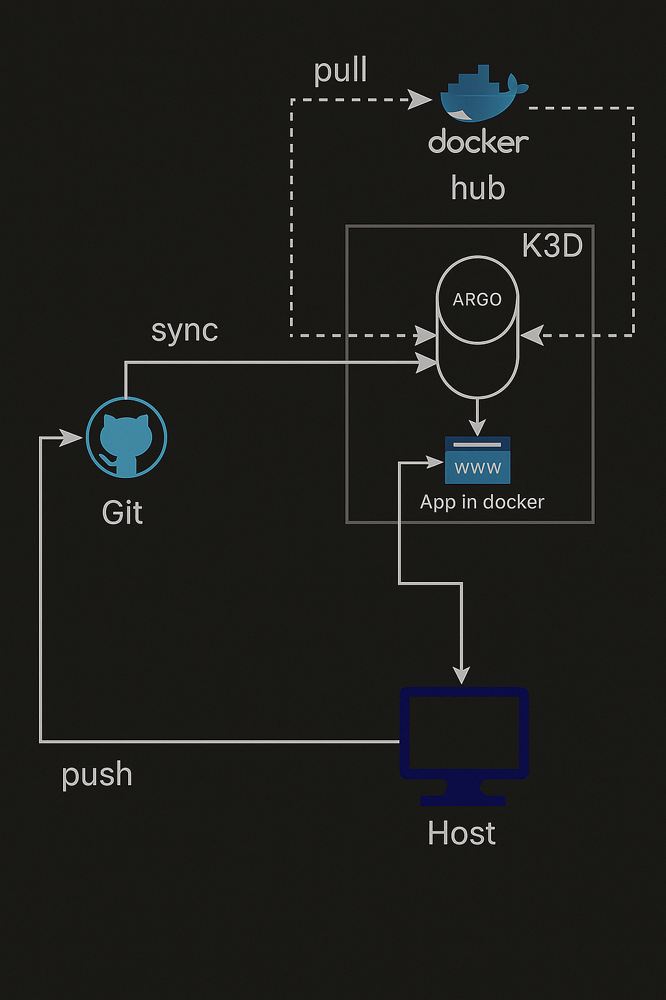

# 🎯 Part 3 (P3) - Advanced K3s with CI/CD Pipeline

This part demonstrates an advanced K3s setup with continuous integration and deployment capabilities, showcasing GitOps workflows and automated application deployment.

Here a diagram of the architecture used in this part:


## How to set up the environment:

### 📜 Reset & Cleanup (without deleting the images)

```bash
k3d cluster delete iot-cluster
```

---

### 🚀 Renew the cluster (aus setup.sh)

```bash
cd bootstrap
./setup.sh
```

---

### 📱 Set KUBECONFIG (for new terminals!)

```bash
export KUBECONFIG=$(k3d kubeconfig write iot-cluster)
```

> 📌 **Note:** You must run this command **in every new terminal tab** or after a restart – otherwise `kubectl` will not find the cluster!

---

### 🔐 Argo CD Access

```bash
kubectl -n argocd get secret argocd-initial-admin-secret \
  -o jsonpath="{.data.password}" | base64 -d && echo

kubectl port-forward svc/argocd-server -n argocd 8080:443
```

Then go to your browser: [https://localhost:8080](https://localhost:8080)

Login:

* **User**: `admin`
* **PW**: (see above)

---

### 🗺 Deployment of the Argo CD Application

```bash
kubectl apply -f manifests/application.yaml
```

Important in the YAML:

* `repoURL`: your GitHub repo
* `path`: e.g. `manifests`
* `targetRevision`: usually `main`
* `image`: e.g. `wil42/playground:v2`

---

### 🔮 Test the app (when ArgoCD app is green)

```bash
kubectl get pods -n dev
kubectl get svc -n dev
kubectl port-forward svc/lbrusaapp -n dev 8888:80
curl http://localhost:8888
```

---
